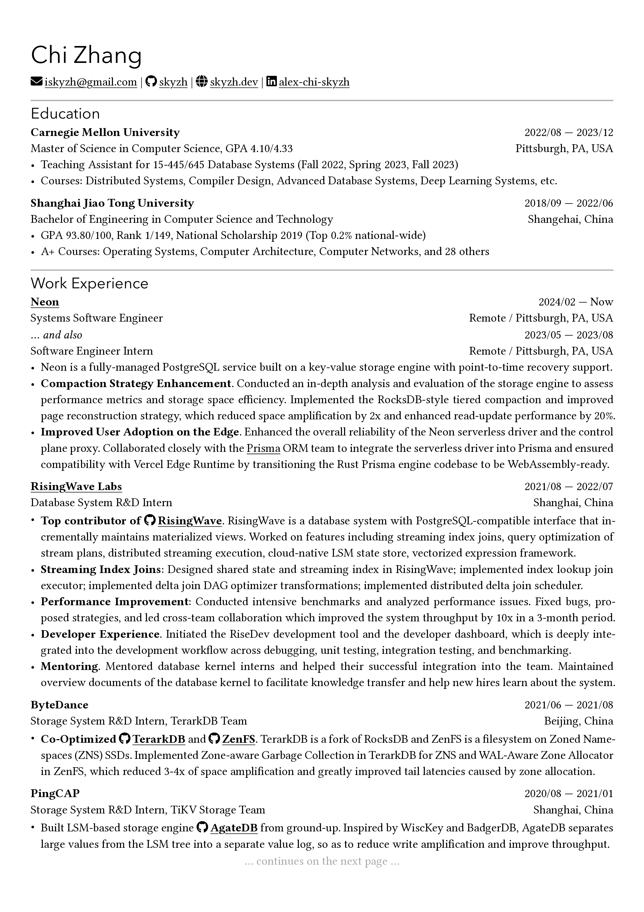

# Chi CV template, but Typst

Rip-off of [rip-off of skyzh's CV](https://github.com/matchy233/chi-cv-template), using [Typst](https://github.com/typst/typst).

PRs and suggestions are welcome.

~~⚠️ The implementation of `fontawesome.typ` is far from perfect and **may** conflict with existing `typst` built-in commands! Please report any issues you find.~~

**[🔮New! (2024/10/09)]** I switched to use [`typst-fontawesome`](https://github.com/duskmoon314/typst-fontawesome)

~~`fonts/FontAwesome6.otf` is generated by merging `Font Awesome 6 Free-Solid-900.otf` and `Font Awesome 6 Brands-Regular-400.otf` using [fontforge](https://fontforge.org/en-US/). Original Font Awesome fonts were downloaded from [here (Desktop version)](https://fontawesome.com/download) (6.0.4 as of 2023/04/01).~~

**[🔮New! (2024/10/09)]** As the template is now dependent on `typst-fontawesome`, I decided to provide the original Font Awesome fonts instead of the merged one.

## Sample Output

<p align="center">
  
  
</p>

[PDF file](resume.pdf)

## Getting Started

### Using Typst web app

**[🚧 WIP (2024/10/09)]** There is plan for releasing the template to [Typst universe](https://typst.app/universe/). Stay tuned!

Upload `chicv.typ`, `resume.typ` and `fonts/*` to [Typst](https://typst.app/), and then you can edit the CV.

### Locally

Assume that you have installed `typst` cli already and it's in your `$PATH`.

```bash
git clone https://github.com/matchy233/typst-chi-cv-template.git
cd typst-chi-cv-template
typst compile --font-path ./fonts ./template/resume.typ resume.pdf
```

## Usage

```typst
#import "@preview/chicv-ripoff:1.0.1": *

// Customize the page margin and cventry paragraph padding
// It's the same as #set page(...)
#show: chicv.with(
  margin: (x: 1cm, top: 1.5cm, bottom: 2cm),
  par-padding: (left: 0pt, right: 0pt),
)

// Chi's name
= Chi Zhang

// Display the input values in one line separated by vertical bars, preceded by a Font Awesome icon
#personal-info(
  // email, phone, github, website, linkedin have pre-defined styles
  email: "iskyzh@gmail.com",
  phone: "+1 (145) 141-919",
  github: "https://github.com/skyzh",
  website: "https://skyzh.dev",
  linkedin: "https://www.linkedin.com/in/alex-chi-skyzh/",
  // It is also possible to feed customized values using:
  // --> Format 1: <icon-name>: <link>
  x-twitter: "https://twitter.com/iskyzh",
  // --> Format 2: a dictionary like below
  (link: "https://typst.app/", text: "Typst", icon: "t", solid: true),
)

== Education

// by default, #cventry will bold top-left text
#cventry(
  tl: "Carnegie Mellon University",
  // #dates(from: xxx, to: xxx) generates a date range, "to" is optional
  tr: dates(from: "2022/08", to: "2023/12"),
  bl: "Master of Science in Computer Science, GPA 4.10/4.33",
  br: "Pittsburgh, PA, USA"
)[
  - Teaching Assistant for 15-445/645 Database Systems (Fall 2022, Spring 2023, Fall 2023)
  - Courses: Distributed Systems, Compiler Design, Advanced Database Systems, Deep Learning Systems, etc.
]

// ...
// omitted
// ...

== Work Experience

// but you can override the default bold style by passing content blocks
#cventry(
  tl: [#link("https://neon.tech")[*Neon*]],
  tr: dates(from: "2024/02"),
  bl: [Systems Software Engineer],
  br: [Remote / Pittsburgh, PA, USA],
  // you can also override the default padding of content blocks
  padding: (bottom: -5pt)
)[]

#cventry(
  tl: [_... and also_],
  tr: dates(from: "2023/05", to: "2023/08"),
  bl: [Software Engineer Intern],
  br: [Remote / Pittsburgh, PA, USA],
)[
 // content omitted
]

// The template also provides #iconlink and #githublink (a shorthand for #iconlink(icon: "github", text: ..., ...))
#iconlink("https://github.com/tikv/tikv/issues/9747", text: "TiKV", icon: "heart")
#githublink("https://github.com/tikv", text: "tikv")

```
