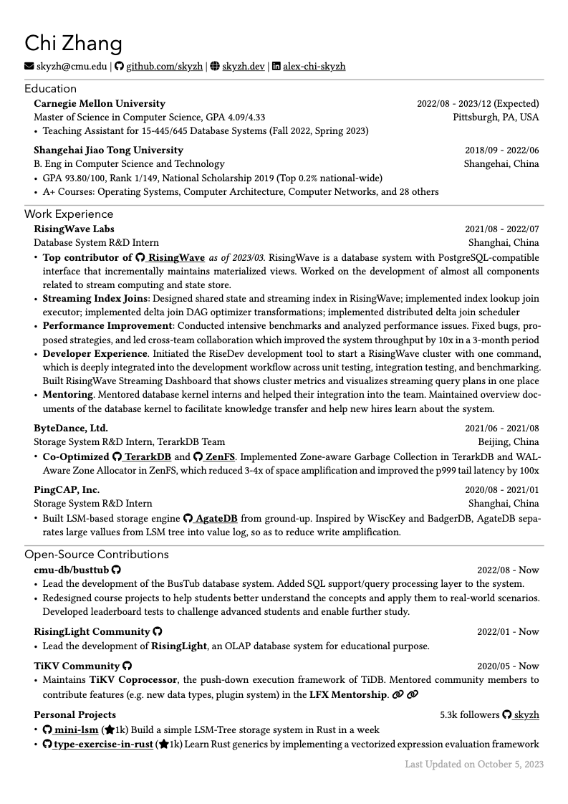

# Chi CV template, but Typst

Rip-off of [rip-off of skyzh's CV](https://github.com/matchy233/chi-cv-template), using [Typst](https://typst.app/).

Like everyone else I'm new to Typst :) This template mainly serves as a "learning" repo for me to get familiar with `typst` functionalities. PRs and suggestions are welcome.

⚠️ The implementation of `fontawesome.typ` is far from perfect and **may** conflict with existing `typst` built-in commands! Please report any issues you find.

`fonts/FontAwesome6.otf` is generated by merging `Font Awesome 6 Free-Solid-900.otf` and `Font Awesome 6 Brands-Regular-400.otf` using [fontforge](https://fontforge.org/en-US/). Original Font Awesome fonts were downloaded from [here (Desktop version)](https://fontawesome.com/download) (6.0.4 as of 2023/04/01).

## Usage

### Using Typst web app

Upload `chicv.typ`, `fontawesome.typ`, `resume.typ` and `fonts/FontAwesome6.otf` to [Typst](https://typst.app/), and then you can edit the CV.

### Locally

Assume that you have installed `typst` cli already and it's in your `$PATH`.

```bash
git clone https://github.com/matchy233/typst-chi-cv-template.git
cd typst-chi-cv-template
typst compile --font-path ./fonts resume.typ resume.pdf
```

## Sample Output



[PDF file](resume.pdf)
