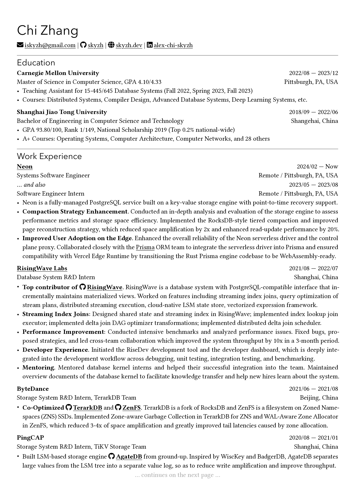
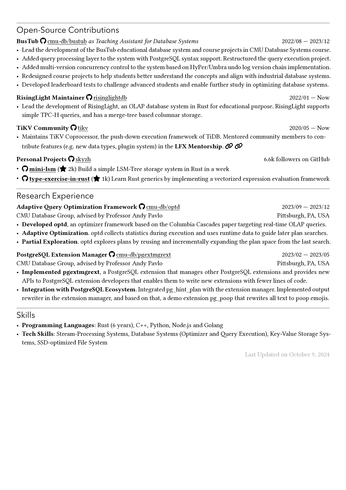

# Chi CV

Minimal, customizable CVs with compact entries for [Typst](https://typst.app/).

This template is based on [Chi's CV](https://github.com/matchy233/chi-cv-template)
and is packaged for Typst Universe as `chicv-ripoff`.

## Preview

<p align="center">
  
  
</p>

[PDF preview](assets/images/resume.pdf)

## Quick Start

Create a new CV from the template:

```bash
typst init @preview/chicv-ripoff:1.1.0
```

Then compile the generated file:

```bash
typst compile resume.typ
```

## Direct Import

You can also import the package in an existing Typst file:

```typst
#import "@preview/chicv-ripoff:1.1.0": *

#show: chicv.with(
  margin: (x: 1cm, top: 1.5cm, bottom: 2cm),
  par-padding: (left: 0pt, right: 0pt),
)

= Chi Zhang

#personal-info(
  email: "person@example.com",
  github: "https://github.com/example/person",
  website: "https://example.com",
  linkedin: "https://www.linkedin.com/in/example/",
)

== Education

#cventry(
  tl: "Carnegie Mellon University",
  tr: dates(from: "2022/08", to: "2023/12"),
  bl: "Master of Science in Computer Science",
  br: "Pittsburgh, PA, USA",
)[
  - Teaching Assistant for database systems.
  - Coursework in distributed systems, compilers, and machine learning.
]
```

## API

The package exports these helpers:

- `chicv`: page and heading style wrapper, usually used with `#show: chicv.with(...)`.
- `personal-info`: renders contact links with Font Awesome icons.
- `cventry`: renders a compact two-column CV entry.
- `dates`: formats a date range.
- `iconlink`: renders a link with a Font Awesome icon.
- `githublink`: shorthand for GitHub links.

## Fonts

The template uses `Avenir Next LT Pro` when available and falls back to
`New Computer Modern`. It also uses
[`fontawesome`](https://typst.app/universe/package/fontawesome/) for contact
icons.

This repository includes the tested font files in `fonts/`. For local CLI
development from this repository, compile with:

```bash
typst compile --font-path fonts template/resume.typ resume.pdf
```

When using the Typst web app, upload the needed font files if your project does
not already provide them.

## Local Development

Install the package into the local preview namespace:

```bash
just install-preview
```

Then compile the template:

```bash
typst compile --font-path fonts template/resume.typ resume.pdf
```

If `just` is unavailable, copy the package files to your Typst package path under
`preview/chicv-ripoff/1.1.0`.

## License

MIT. See [LICENSE](LICENSE).
